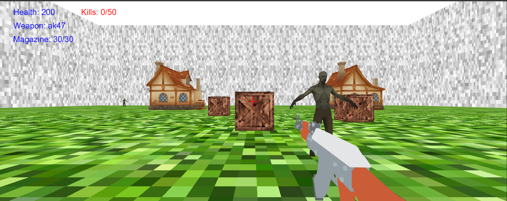

# WebGL 2 graphics engine 
Project started within FRI Computer Graphics course.

Notable contribution: 
- CharacterActionController.js
- CharacterMovementController.js
- AssetManager.js
- HUDRenderer.js
- HUDSystem.js
- AudioSystem.js
- NPCSystem.js
- WeaponSystem.js

